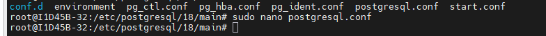
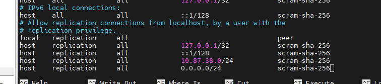

## Configurando o SGBD 
SGBD: Sistema Gerenciador de Banco de Dados 
Para instalação, utilizamos o comando:

```bash
sudo apt install -y postgresql
```

>No meu servidor, como eu já estava como root, não foi necessário o sudo.

Para acesso inicial, utilizamos o comando:

```bash
sudo -u postgres psql
```
>Autenticação via Linux, não necessita de senha, pois você já está autenticado. 

Após primeiro acesso, alteramos a senha, através do comando:

```sql 
ALTER USER postgres PASSWORD '1234';
``` 

Para sair do SGBD, utilizamos o comando: `\q`. 
>Comando famoso \quit em games. 

Para acesso externo, utilizamos o comando:
```bash
sudo psql -h 127.0.0.1 -U postgres
``` 
>Aqui, ele vai necessitar de senha! 

--- 
Alterações nos arquivos:
1. Navegamos até o caminho:
```bash
cd /etc/postgresql/18/main
```
2.Editamos o arquivo postgresql.conf através do comando:
```bash
sudo nano postgresql.conf
```
Linha listen_adresses = '*' 
>Para pesquisar a linha: `CTRL+W`



3.Segunda alteração no arquivo pg_hba.conf:
```bash 
sudo nano pg_hba.conf
```
4.Alterações realizadas:
