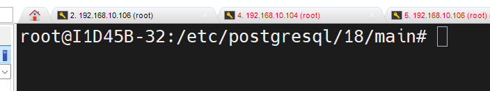

## SGBD
Instalar e configurar o SGBD PostgreSQL.

Comando para instalar o SGBD: 

```bash
sudo apt install -y postgresql
``` 
>Obs: O comando sudo, no nosso caso, pode ser omitido pois já somos root.
---
Realizando verificação do SGBD:
```bash
pg_lsclusters
``` 

Para realizar o acesso ao SGBD **sem senha**, utilizar o comando: 

```bash
sudo -u postgres psql
``` 
>Com esse comando o acesso é feito sem senha, pois o Linux já provou quem você é (root). Autenticação PEER.

Para primeiro acesso, alterei a senha:

```sql 
ALTER USER postgres PASSWORD '1234';   
``` 

>O retorno correto, é `ALTER ROLE`. 

Para sair do postgres, comando `/q` (igual o \quit de vários jogos).


--- 
## Configurações de serviço 
> Caminho padrão para as configurações do POSTGRESQL.


**Primeira configuração**:

```bash 
sudo nano postgresql.conf
``` 
CTRL + W para buscar a linha do listen_addresses e descomentamos, alterando para `*`.

Se ficar localhost, somente o meu PC acessa.

Passo 2: 
```bash 
sudo nano pg_hba.conf
```
Nas últimas linhas, adicionei:
host all all 10.87.38.0/24 scram-sha-256

Para criar um banco de dados, usamos o comando:
```sql
CREATE DATABASE lojamax;
``` 

Para visualizar os bancos:
```bash
\l
```

Para sair:
```bash
\q
``` 


