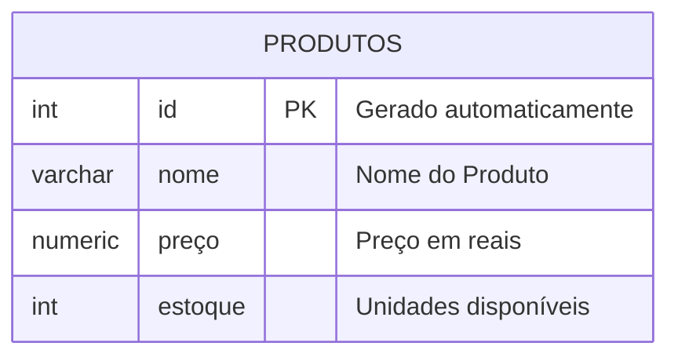

## Aula 04
Comando para apagar um banco de dados:

```sql 
DROP DATABASE lojamax;
``` 
---
O objetivo é criar uma loja para aprender os principais comandos SQL. 



Para criar a tabela, utilizamos os comandos abaixo:
```sql 
CREATE TABLE produtos(
    id INT GENERATED ALWAYS AS IDENTITY PRIMARY KEY,
    nome VARCHAR(50) NOT NULL,
    preco NUMERIC(10,2) NOT NULL,
    estoque INT NOT NULL DEFAULT 0
);
```

Para inserir dados na tabela, utilizei os comandos abaixo: 
```sql
INSERT INTO produtos(nome,preco,estoque) 
VALUES('Iphone 17','10000.00','15');
```
Para apagar uma tabela, utilizamos o comando:
```sql 
DROP TABLE produtos;
```
---
Adicionando múltiplos valores: 

```sql 
INSERT INTO produtos(nome,preco,estoque)
VALUES
('Notebook Gamer','2000.00','10'),
('Cadeira Gamer','1000.00','5');
```
>Essa forma facilita a inserção de múltiplos valores na tabela. 