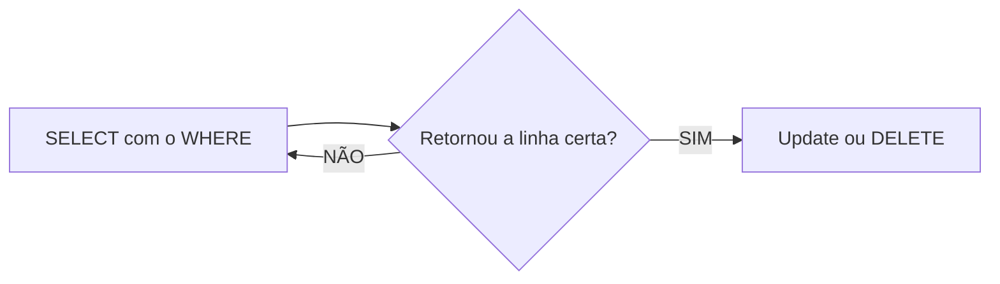
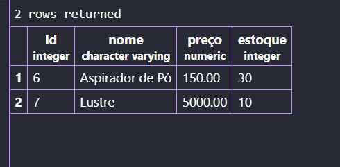

## Update e Delete 
**UPDATE** ou **DELETE** afetam todas as linhas da sua tabela. Logo, **JAMAIS** executar sem o comando `WHERE`.






```sql 
UPDATE filmes
SET avaliacao=10
WHERE nome='Tropa de Elite';
```