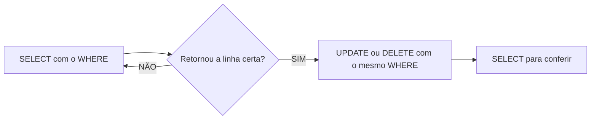

## Aula 05 
Para filtrar colunas, utilizamos o comando:

```sql 
SELECT nome,preço FROM produtos;
``` 

Para filtro de registros, utilizamos o comando:

```sql 
SELECT * FROM produtos WHERE estoque < 10;
```
Para ordenar os dados:
```sql 
SELECT nome,preço FROM produtos
ORDER BY preço DESC;
```

---

**UPDATE**: Update ou Delete sem `WHERE` atinge TODAS as linhas! Não existe Ctrl+Z :( 

Fluxo seguro (sempre):


Para UPDATE: 
```sql
UPDATE produtos
SET preço=150
WHERE nome='Chuveiro';
```
---
Também é possível realizar cálculos:
```sql 
UPDATE produtos
SET estoque = estoque - 3
WHERE id = 2;
```
**Delete**:
Para apagar registros:
```sql
DELETE FROM produtos WHERE nome='Notebook';
```

